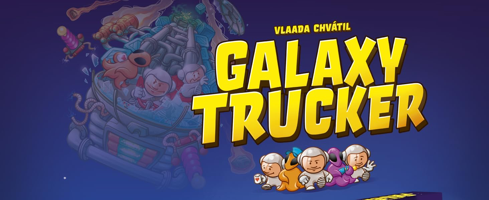

  

# 🚀 Galaxy Trucker - Software Engineering Final Project (2024/2025)

## Introduction

This repository contains the implementation of the final project for the **Software Engineering** course at Politecnico di Milano (AY 2024/2025). The project consists in developing a software version of the board game *Galaxy Trucker*, respecting the specifications provided in the requirements document.
## Team Members

- [Anatoly Contu](https://github.com/AnatolyContu)
- [Federico Costa](https://github.com/costafede)
- [Emanuele De Simone](https://github.com/EmanueleDeSimone04)
- [Jia Hui Dong](https://github.com/JHDongg)

## Project Structure (to be fixed later)

- `src/main/java` - Source code of the application
- `src/test/java` - Unit tests
- `docs/` - Documentation, including peer review and UML diagrams
- `resources/` - Configuration files and graphic assets

## Used Technologies

- **Language**: Java SE
- **Framework**: JavaFX / Swing per GUI
- **Architectural Pattern**: Model-View-Controller (MVC)
- **Communication**: Socket TCP-IP e/o RMI
- **Build Tool**: Maven
- **Version Control**: Git

## Project Requirements

Detailed in the document [requirements.pdf](resources/Requirements/requirements.pdf).

---

## Project Progress

### 🔑 Legend

| Symbol  | Meaning                        |
|--------|--------------------------------|
| ✅      | Completed and fully functional |
| 👨🏻‍💻   | Work In Progress               |
| ❌      | Not implemented / Not planned  |

---

### 📜 Progress Table

| Requirements                            | Status    |
|-----------------------------------------|----------|
| Full implementation of game rules       | 👨🏻‍💻    |
| Initial UML diagram                     | 👨🏻‍💻    |
| Final UML diagram                       | 👨🏻‍💻    |
| Command Line Interface (CLI)             | 👨🏻‍💻    |
| Graphical User Interface (GUI - JavaFX) | 👨🏻‍💻    |
| Client-Server communication via Socket  | 👨🏻‍💻    |
| Client-Server communication via RMI     | 👨🏻‍💻    |
| Test Flight mode                        | 👨🏻‍💻    |
| Multiple game sessions                  | 👨🏻‍💻    |
| Resilience to disconnections            | 👨🏻‍💻    |
| Persistence of game state               | 👨🏻‍💻    |
| JavaDoc documentation                   | 👨🏻‍💻    |
| JUnit Testing                           | 👨🏻‍💻    |

---

## Authors and License

© 2025 Politecnico di Milano.  
Project developed for the **Software Engineering** course.  
All rights reserved.  